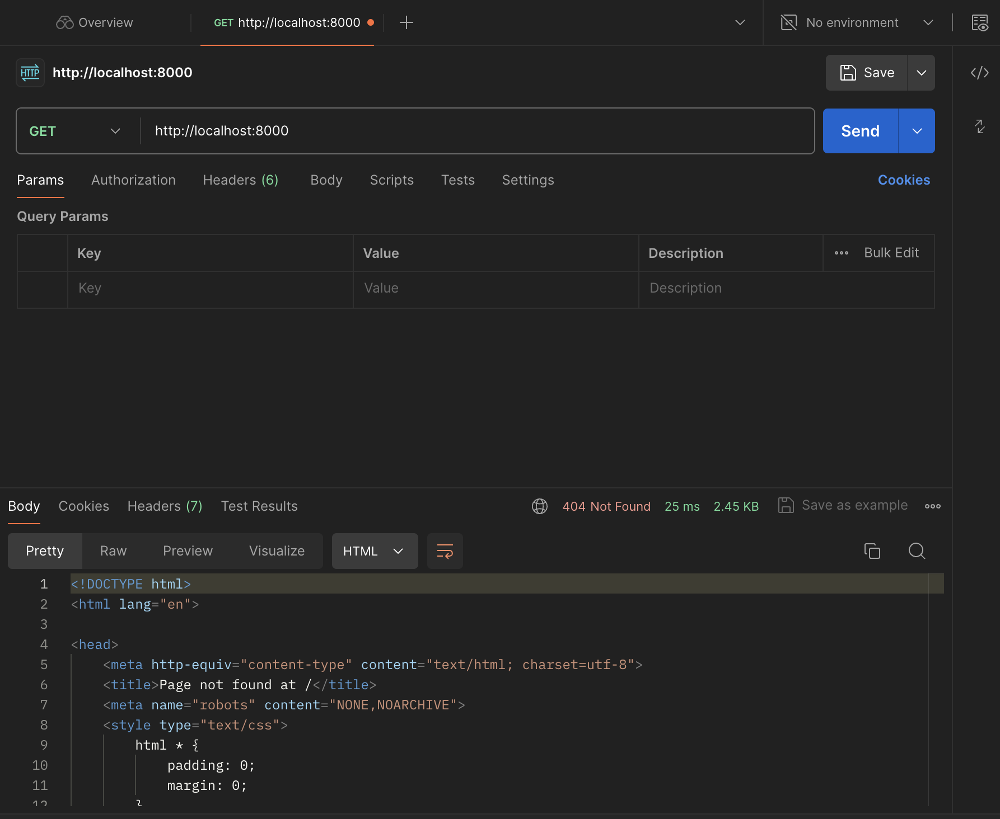

# Experiment 7

## Requirements
- Python3 Image
- Postgres Image

## Important end-points
```
users/login/ --> login a user
users/me/ --> get information of logged-in user
users/create/ --> create a user
users/<id>/delete/ --> delete a user
notes/ --> list all notes of current user
notes/<id>/ --> get details of a note
notes/create/ --> create a note
notes/<id>/delete/ --> delete a note
```

## How to run

### Navigate to the root directory:
```
docker compose -f docker-compose.yml --build up
```

This command will deploy your django server with postgres and expose it on port 8000 of your localhost.


After that we are able to send requests to http://localhost:8000 from our computers.



### Migration

First with command below move to the container core:
```
docker exec -it (container-ID) bash
```
Then run these command in order to create admin:
```python
python manage.py makemigrations
python manage.py migrate
```


```python
python manage.py createsuperuser
```


Now we can login to admin panel using url http://localhost:8000/admin/login and in my scenario admin='admin' and password='1234':


## Explanations

### Dockerfile

```dockerfile
FROM docker.arvancloud.ir/python:3
ENV PYTHONDONTWRITEBYTECODE=1
ENV PYTHONUNBUFFERED=1
WORKDIR /Experiment7
COPY requirements.txt .
RUN pip install -r requirements.txt
COPY . .
CMD ["python", "manage.py", "runserver", "0.0.0.0:8000"]
```

- As far as handshake timed out for regular python:3 image we use docker.arvancloud.ir/python:3 instead.
- Then we set enviroment variables to avoid buffering and writing bytecodes.
- First we set the working directory to current (Experiment7).
- Second we copy requirements.txt from current path to the container directory to use it in the next command.
- As far as we have copied requirements.txt to the container path we can run pip install with this file as an input.
- Using the last line we start and expose django server on port 8000.

### Yaml file

```yaml
services:
  db:
    image: docker.arvancloud.ir/postgres:15
    restart: always
    volumes:
      - ./data/db:/var/lib/postgresql/data
    environment:
      - POSTGRES_DB=postgres
      - POSTGRES_USER=postgres
      - POSTGRES_PASSWORD=postgres
  web:
    build: .
    command: python manage.py runserver 0.0.0.0:8000
    volumes:
      - .:/app
    ports:
      - "8000:8000"
    environment:
      - POSTGRES_NAME=postgres
      - POSTGRES_USER=postgres
      - POSTGRES_PASSWORD=postgres
    depends_on:
      - db
```

- First we define DB service. We get Postgres image from arvancloud because of the internet issues.
- Second with setting restart to always, as soon as anything terminates the database docker will restart it automaticaly.
- By setting the proper volume we make docker-compose to move files in the container in the mentioned path to our local machine. (This helps us so much in debugging and so many things.)
- Env variables makes our project to avoid hardcodes. We can use these variables everywhere in our codes.
---

- To create the web service, First we build the Dockerfile we created before.
- Using the command we start the Django server on the mentioned port.
- ports field will map port 8000 of the container to port 8000 of localhost so we can send requests to localhost and get answers.
- depends_on field will show that web service is depends on DB.

### Settings.py

```python
DATABASES = {
    'default': {
        'ENGINE': 'django.db.backends.postgresql',
        'NAME': os.environ.get("POSTGRES_NAME"),
        'USER': os.environ.get("POSTGRES_USER"),
        'PASSWORD': os.environ.get("POSTGRES_PASSWORD"),
        'HOST': 'db',
        'PORT': '5432',
    }
}
```

We should change DATABASE field in Django settings file to connect our Postgres to web server. As soon as we change the default Database config to ours, We will have a Django connected to our database.

- ENGINE shows the database engine we want to use as default.

- Other attributes are set using the Env variables in the docker-compose file to avoid hardcode.

## Test

### Test 1:

With a POST request to http://localhost:8000/users/create/ with body contained username and password, We created user1.


Then in the admin panel we can see the new user we just created.


### Test 2:

First we login as user1 that we just created.


Then we create a note with title1 and body1 using a POST request.


As we can see in the picture below the note we just created is here.


### Test 3

We create note with title2 and body2 like this:


### Test 4

We can see a list of all notes which we created before.

